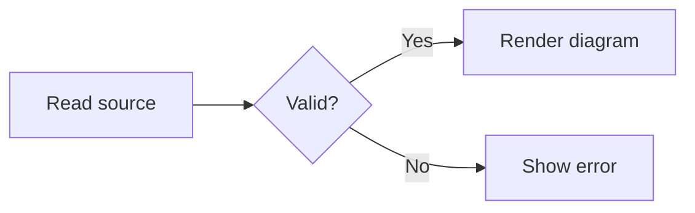
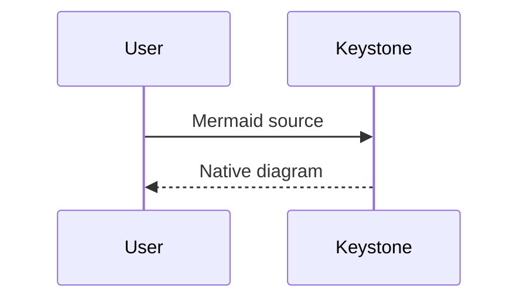
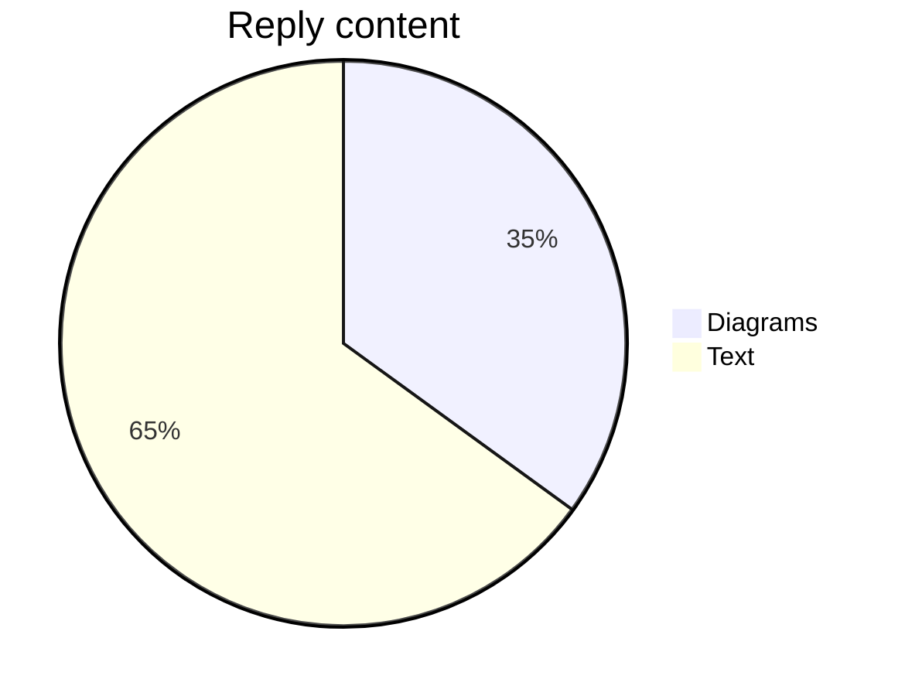

### Flowchart

```mermaid
flowchart LR
  A[Read source] --> B{Valid?}
  B -->|Yes| C[Render diagram]
  B -->|No| D[Show error]
```

### Sequence

```mermaid
sequenceDiagram
  participant User
  participant Keystone
  User->>Keystone: Mermaid source
  Keystone-->>User: Native diagram
```

### Pie

```mermaid
pie title Reply content
  "Diagrams" : 35
  "Text" : 65
```
